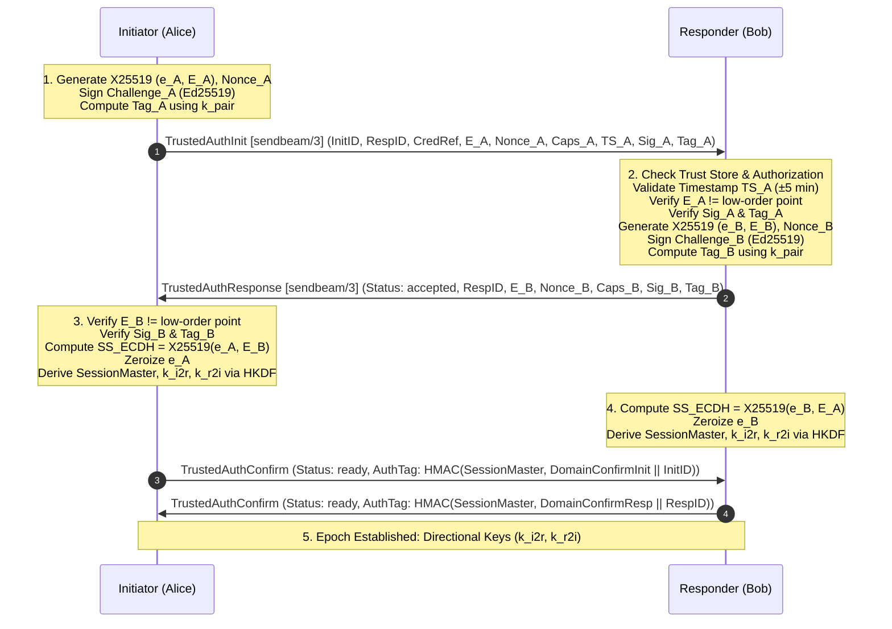

# ADR 0010: Versioned Authenticated Ephemeral Key Exchange, Replay Defense, and Trust Authorization Model

**Status:** Accepted  
**Date:** 2026-09-07  
**Context:** SendBeam v1.9 Milestone V19-PR01  
**Deciders:** Core Engineering Team  
**Supercedes / Extends:** ADR 0008 (Revocation Sync)

---

## 1. Context & Problem Statement

SendBeam v1.5 introduced persistent device identities (Ed25519) and pairwise trusted sessions (`sendbeam/2`) allowing previously paired devices to authenticate each other and automate transfers without human room codes or centralized accounts. In v1.7, ADR 0008 added signed mesh revocation records.

However, security analysis and audit findings (recorded in the v1.8 → v2.0 Evolution Roadmap) identified two critical architectural limitations in the v1.5–v1.8 trust implementation:

### 1.1 Lack of Ephemeral Forward Secrecy in `sendbeam/2`

In `packages/wire/trusted_auth.go` and `packages/protocol/src/trusted-auth.ts`, session traffic keys were derived as:
$$\text{IKM} = \text{HMAC-SHA256}(k_{pair}, \text{EphemPub}_A \parallel \text{EphemPub}_B \parallel \text{Nonce}_A \parallel \text{Nonce}_B)$$

Although ephemeral public values and nonces were exchanged, they were simply hashed and MAC-authenticated under the long-term pairwise secret $k_{pair}$ rather than combined through an ephemeral Diffie-Hellman key exchange. Consequently:

- If $k_{pair}$ is compromised at any point in the future, an adversary who passively recorded past network traffic can reconstruct the session master and all directional transfer traffic keys ($k_{i2r}, k_{r2i}$).
- **`sendbeam/2` does not provide forward secrecy.**

### 1.2 Unconstrained Revocation Authority in ADR 0008

In ADR 0008 §2.3, the revocation ingestion rule stated:

> _"Device C checks if Revoker A is registered in Device C's local trust database (`trust.json`). If Revoker A is unknown or unpaired, the record is ignored fail-closed."_

However, ADR 0008 did not distinguish between **same-owner device clusters** and **ordinary pairwise contacts** (e.g. colleagues, one-time collaborators, friends):

- If Device C pairs with Contact A, Contact A became capable of signing a `RevocationRecord` targeting Device B (another device paired with C, such as C's owner laptop).
- Device C would verify A's signature, observe that A is in C's trust database, and mark Device B as revoked!
- Ordinary contacts must never possess administrative authority to revoke arbitrary third-party devices across an owner's mesh.

### 1.3 Goals for `v1.9` (V19-PR01 Deliverable)

1. **True Ephemeral Forward Secrecy (`sendbeam/3`):** Design an authenticated ephemeral Diffie-Hellman key exchange using standard, reviewed primitives (X25519 + HKDF-SHA256) with full transcript, identity, role, and capability binding.
2. **Strict Downgrade & Replay Defense:** Prevent downgrade to `sendbeam/2` or `sendbeam/1` for paired peers; prevent capability stripping; enforce tight timestamp freshness and nonce deduplication.
3. **Rigorous Authorization Hierarchy ("Who May Revoke Whom"):** Formally define revocation permissions distinguishing self-tombstones, pairwise unpairing, and same-owner mesh cluster administration.
4. **Safety Invariants & Clean Separation:** Never redefine deployed `sendbeam/2` bytes in place; preserve `sendbeam/1` one-time transfers; ensure atomic credential lifecycle and fail-closed error handling.

---

## 2. Cryptographic Key Exchange: `sendbeam/3`

To provide true forward secrecy while preserving mutual authentication, SendBeam v1.9 defines **`sendbeam/3`**, an authenticated ephemeral Diffie-Hellman protocol based on X25519 (RFC 7748) and HKDF-SHA256 (RFC 5869), combined with dual-layer Ed25519 identity signatures and pairwise $k_{pair}$ symmetric MAC authentication.



### 2.1 Cryptographic Primitives

- **Ephemeral Key Agreement:** X25519 (32-byte public keys, scalar multiplication over Curve25519 as per RFC 7748).
  - Go: `crypto/ecdh.X25519()`
  - TypeScript: `@noble/curves/ed25519.x25519` / WebCrypto Subtle X25519.
- **Identity Authentication:** Ed25519 (RFC 8032) signing with long-term device identity key.
- **Pairwise Symmetric Authentication:** HMAC-SHA256 under $k_{pair}$ (32 bytes).
- **Key Derivation Function:** HKDF-SHA256 (RFC 5869) with extract-then-expand.
- **Transcript Digest:** SHA-256 (32 bytes).

### 2.2 Wire Messages (`sendbeam/3`)

#### Message 1: `TrustedAuthInit`

```json
{
  "type": "trusted_auth_init",
  "protocol_version": "sendbeam/3",
  "initiator_device_id": "sb-dev-...",
  "responder_device_id": "sb-dev-...",
  "pair_credential_ref": "cred-...",
  "ephemeral_pub": "<64 hex chars: 32-byte X25519 public key E_A>",
  "nonce": "<64 hex chars: 32-byte fresh random nonce N_A>",
  "capabilities": ["transfer.v1", "padding", "resume"],
  "timestamp": "2026-09-07T12:00:00Z",
  "signature": "<128 hex chars: 64-byte Ed25519 signature over Challenge_A>",
  "auth_tag": "<64 hex chars: 32-byte HMAC-SHA256 tag over Challenge_A using k_pair>",
  "revocations": []
}
```

#### Message 2: `TrustedAuthResponse`

```json
{
  "type": "trusted_auth_response",
  "protocol_version": "sendbeam/3",
  "status": "accepted",
  "responder_device_id": "sb-dev-...",
  "ephemeral_pub": "<64 hex chars: 32-byte X25519 public key E_B>",
  "nonce": "<64 hex chars: 32-byte fresh random nonce N_B>",
  "capabilities": ["transfer.v1", "padding", "resume"],
  "signature": "<128 hex chars: 64-byte Ed25519 signature over Challenge_B>",
  "auth_tag": "<64 hex chars: 32-byte HMAC-SHA256 tag over Challenge_B using k_pair>",
  "revocations": []
}
```

#### Message 3: `TrustedAuthConfirm`

```json
{
  "type": "trusted_auth_confirm",
  "status": "ready",
  "auth_tag": "<64 hex chars: 32-byte HMAC-SHA256 tag over SessionMaster and DeviceID>"
}
```

### 2.3 Challenge and Signature Specifications

Domain strings for `sendbeam/3`:

```
DomainTrustedInit3        = "sendbeam/3 trusted-init:"
DomainTrustedInitMAC3     = "sendbeam/3 trusted-init-mac:"
DomainTrustedResp3        = "sendbeam/3 trusted-resp:"
DomainTrustedRespMAC3     = "sendbeam/3 trusted-resp-mac:"
DomainTrustedMaster3      = "sendbeam/3 session-master:"
DomainTrustedInitToResp3  = "sendbeam/3 initiator-to-responder key"
DomainTrustedRespToInit3  = "sendbeam/3 responder-to-initiator key"
DomainTrustedConfirmInit3 = "sendbeam/3 confirm-init:"
DomainTrustedConfirmResp3 = "sendbeam/3 confirm-resp:"
```

#### Challenge A (Initiator):

$$\text{Challenge}_A = \text{DomainTrustedInit3} \parallel \text{SHA256}(k_{pair}) \parallel E_A \parallel N_A \parallel \text{InitID} \parallel \text{RespID} \parallel \text{SHA256}(\text{Caps}_A) \parallel \text{Timestamp}_A$$

- $\text{Sig}_A = \text{Ed25519Sign}(\text{PrivKey}_A, \text{Challenge}_A)$
- $\text{Tag}_A = \text{HMAC-SHA256}(k_{pair}, \text{DomainTrustedInitMAC3} \parallel \text{Challenge}_A)$

#### Challenge B (Responder):

Let $\text{Caps}_{neg} = \text{Sort}(\text{Intersect}(\text{Caps}_A, \text{Caps}_B))$, and $H_{caps} = \text{SHA256}(\text{Join}(\text{Caps}_{neg}, ","))$.
$$\text{Challenge}_B = \text{DomainTrustedResp3} \parallel \text{SHA256}(k_{pair}) \parallel E_A \parallel E_B \parallel N_A \parallel N_B \parallel \text{InitID} \parallel \text{RespID} \parallel H_{caps}$$

- $\text{Sig}_B = \text{Ed25519Sign}(\text{PrivKey}_B, \text{Challenge}_B)$
- $\text{Tag}_B = \text{HMAC-SHA256}(k_{pair}, \text{DomainTrustedRespMAC3} \parallel \text{Challenge}_B)$

### 2.4 Ephemeral Diffie-Hellman Key Agreement & Validation

1. **Curve Point Validation:** Both parties MUST validate that the peer's ephemeral public key is exactly 32 bytes and reject known low-order points or points that generate the all-zero output under X25519 (RFC 7748 §6.1). If scalar multiplication yields all zeros, the session MUST immediately abort fail-closed with `ErrWeakEphemeralKey`.
2. **Shared Secret Computation:**
   $$\text{SS}_{ECDH} = \text{X25519}(e_A, E_B) = \text{X25519}(e_B, E_A) \quad (32\text{ bytes})$$
3. **Immediate Memory Zeroization:** The ephemeral private scalar ($e_A$ or $e_B$) MUST be zeroized in memory immediately after computing $\text{SS}_{ECDH}$.

### 2.5 Hybrid Key Derivation Schedule (Extract-and-Expand)

The key schedule uses standard HKDF-SHA256 (RFC 5869) combining both the ephemeral Diffie-Hellman secret $\text{SS}_{ECDH}$ and the pre-shared pairwise key $k_{pair}$:

#### Step 1: HKDF-Extract

$$\text{PRK} = \text{HKDF-Extract}(\text{salt} = k_{pair}, \text{IKM} = \text{SS}_{ECDH})$$

- **Forward Secrecy Property:** Because $\text{SS}_{ECDH}$ is the input keying material ($\text{IKM}$), knowledge of $k_{pair}$ alone without $\text{SS}_{ECDH}$ cannot produce $\text{PRK}$ (relying on the hardness of the Computational Diffie-Hellman problem on Curve25519).
- **Authentication Guarantee:** Because $k_{pair}$ serves as the extraction salt, an attacker cannot forge $\text{PRK}$ even if they attempt man-in-the-middle key replacement on $E_A$ and $E_B$ without knowledge of $k_{pair}$.

#### Step 2: Transcript Binding

$$\text{Transcript} = \text{"sendbeam/3 transcript:"} \parallel \text{SHA256}(k_{pair}) \parallel E_A \parallel E_B \parallel N_A \parallel N_B \parallel \text{InitID} \parallel \text{RespID} \parallel H_{caps}$$

#### Step 3: HKDF-Expand

1. **Session Master:**
   $$\text{SessionMaster} = \text{HKDF-Expand}(\text{PRK}, \text{DomainTrustedMaster3} \parallel \text{Transcript}, 32)$$
2. **Directional Traffic Keys (for AES-256-GCM Transfer Frames):**
   $$k_{i2r} = \text{HKDF-Expand}(\text{SessionMaster}, \text{DomainTrustedInitToResp3}, 32)$$
   $$k_{r2i} = \text{HKDF-Expand}(\text{SessionMaster}, \text{DomainTrustedRespToInit3}, 32)$$

### 2.6 Mutual Confirmation Handshake

Before any payload or file transfer control frames are accepted:

1. **Initiator Confirmation:** Initiator sends `TrustedAuthConfirm` with:
   $$\text{ConfirmTag}_A = \text{HMAC-SHA256}(\text{SessionMaster}, \text{DomainTrustedConfirmInit3} \parallel \text{InitID})$$
2. **Responder Confirmation:** Responder sends `TrustedAuthConfirm` with:
   $$\text{ConfirmTag}_B = \text{HMAC-SHA256}(\text{SessionMaster}, \text{DomainTrustedConfirmResp3} \parallel \text{RespID})$$
3. **Verification:** Both tags must be verified using constant-time comparison (`subtle.ConstantTimeCompare`). The transfer session enters the `ready` state if and only if both confirmation tags match.

---

## 3. Replay Defense & Downgrade Prevention

### 3.1 Replay Prevention Rules

1. **Ephemeral Freshness:** Fresh 32-byte nonces ($N_A, N_B$) and fresh ephemeral keypairs ($e, E$) must be generated independently for every session attempt using a cryptographically secure random number generator (`crypto/rand` or `crypto.getRandomValues`).
2. **Strict Timestamp Window:** The initiator timestamp $\text{Timestamp}_A$ must satisfy:
   $$|T_{local} - \text{Timestamp}_A| \le 300\text{ seconds (5 minutes)}$$
   Timestamps outside this window must be rejected with `ErrTrustedTimestampSkew`.
3. **In-Memory Nonce Cache:** Nodes maintain an in-memory sliding filter of recently seen $(InitID, N_A)$ tuples for active epochs. Replaying an identical init message within the 5-minute window is rejected with `ErrSessionReplayDetected`.

### 3.2 Protocol Downgrade Rejection Rules

1. **Protocol Negotiation:**
   - Both peers advertise their supported trusted protocol versions.
   - For any peer registered in the local trust database with an established $k_{pair}$, clients **MUST require `sendbeam/3`**.
2. **Strict Downgrade Rejection (Fail-Closed):**
   - If a peer attempts to initiate or respond using `sendbeam/2` or `sendbeam/1` for a trusted device transfer, the session **MUST be terminated immediately** with `ErrProtocolDowngradeForbidden`.
   - **No Silent Fallback:** A trusted-device session must NEVER silently degrade into an unauthenticated room-code transfer or a legacy `sendbeam/2` session.
3. **Capability Stripping Resistance:**
   - All advertised and negotiated capability strings are cryptographically hashed and bound into the signed challenges $\text{Challenge}_A$, $\text{Challenge}_B$, and the session transcript $\text{Transcript}$.
   - If an intermediary strips capabilities (such as `"padding"` or `"resume"`), the signature and confirmation checks will fail, aborting the connection before any transfer starts.

---

## 4. Authorization Model: Who May Revoke Whom

### 4.1 Problem Analysis of ADR 0008

ADR 0008 enabled transitive mesh propagation of revocation records based solely on the criterion:
$$\text{IsRevokerTrusted}(\text{RevokerID}) == \text{true}$$

This treated all trusted relationships as an undifferentiated clique with global administrative authority. In reality, users establish two fundamentally distinct types of trust relationships:

1. **Personal Device Clusters (Same-Owner Mesh):** A single user's own devices (e.g. Alice's Laptop, Alice's Phone, Alice's Workstation).
2. **Pairwise Contacts (External Peers):** Third parties with whom the user exchanges files (e.g. Alice pairs with Bob, or Alice pairs with Carol).

Granting Bob authority to revoke Alice's Workstation on Alice's Phone violates the principle of least privilege and introduces a denial-of-service vector.

### 4.2 Formal Authorization Hierarchy

To eliminate unauthorized transitive revocations, SendBeam v1.9 defines strict authorization boundaries:

```
+-------------------------------------------------------------------------+
|                         AUTHORIZATION SCOPES                            |
|                                                                         |
|  +-----------------------------------+   +---------------------------+  |
|  |     Owner Cluster (Same User)     |   |    External Contacts      |  |
|  |                                   |   |                           |  |
|  |  +------------+   +------------+  |   |  +------------+           |  |
|  |  |  Laptop A  |<->|  Phone B   |  |   |  | Contact D  |           |  |
|  |  +------------+   +------------+  |   |  +------------+           |  |
|  |        ^                ^         |   |                           |  |
|  |        |  Admin Scope   |         |   |                           |  |
|  |        v                v         |   |                           |  |
|  |  +-----------------------------+  |   |  +------------+           |  |
|  |  |        Workstation C        |<-+---+->| Contact E  |           |  |
|  |  +-----------------------------+  |   |  +------------+           |  |
|  +-----------------------------------+   +---------------------------+  |
+-------------------------------------------------------------------------+
```

#### Rule 1: Self-Tombstone (Universally Permitted)

Any device may revoke **itself**.
$$\text{RevokerDeviceID} == \text{RevokedDeviceID}$$

- **Semantics:** The device announces that it has been retired, decommissioned, or compromised.
- **Authority:** Every peer holding a trust record for $\text{RevokedDeviceID}$ MUST accept a validly signed self-tombstone and immediately distrust that device.

#### Rule 2: Direct Pairwise Unpairing (Local / Direct Link Only)

When Device A unpairs from Device D:

- Device A updates its local store: marks D as revoked or purges D.
- Device A does **NOT** propagate a signed statement to other third parties saying "everyone must revoke D" unless D was an owner-cluster device.
- Device D can only affect its direct link with Device A; Device D has **zero authority** to issue revocations against any other device in Device A's trust store.

#### Rule 3: Owner Cluster Authority (Transitive Mesh Revocation)

A revocation record emitted by Revoker A targeting Device B is accepted by Device C **IF AND ONLY IF** one of the following conditions holds:

1. **Self-Revocation:** $\text{RevokerDeviceID} == \text{RevokedDeviceID}$
2. **Cluster Administrator / Member Authority:**
   - Both Revoker A and Target B are registered in C's trust database with `relationship: "cluster_member"` or `"cluster_owner"`.
   - Revoker A has verified administrative authority over Target B within that cluster.
3. **Contact Revocation by Owner:**
   - Revoker A is a cluster member/owner in C's trust database, and Target B is a pairwise contact. An owner device may notify its other cluster members to revoke an external contact.
4. **Disallowed (Fail-Closed):**
   - An external contact ($\text{relationship} == \text{"contact"}$) attempts to revoke any third-party device ($B \ne A$).
   - **Result:** Device C immediately rejects the record fail-closed with `ErrRevocationUnauthorized`.

### 4.3 Trust Record Schema Updates

The `TrustRecord` structure in `packages/wire` and `packages/protocol` is extended with explicit relationship metadata:

```json
{
  "device_id": "sb-dev-65b60673d6ed884bf01c2c222d82ada0740f29ac3355d6a925c81f17f47a27b8",
  "public_key": "79b5562e8fe654f94078b112e8a98ba7901f853ae695bed7e0e3910bad049664",
  "local_label": "Work Laptop",
  "pair_credential_ref": "cred-78f9a20...",
  "relationship": "cluster_member",
  "cluster_id": "sb-cluster-4f3b...",
  "capabilities": ["transfer.v1", "padding", "resume"],
  "first_seen_at": "2026-09-07T06:00:00Z",
  "last_seen_at": "2026-09-07T06:45:00Z",
  "revoked": false,
  "revoked_at": null,
  "revoked_by": null,
  "revocation_seq": 0,
  "revocation_sig": null,
  "policy": {
    "auto_accept": false,
    "auto_accept_dest_dir": ""
  }
}
```

- `relationship`: `"cluster_member"` (same-owner device) or `"contact"` (external pairwise contact). Defaults to `"contact"` during standard one-time SPAKE2 pairing.
- `cluster_id`: Optional cluster identifier binding devices owned by the same user.

### 4.4 Ingestion & Verification Algorithm

When Device C receives a `RevocationRecord` $(A, B, \text{Seq}, \text{Timestamp}, \text{Sig})$:

```
function IngestRevocationRecord(record):
    1. Parse and validate record syntax and sequence (Seq > 0).
    2. Retrieve Revoker A from local trust store.
       If A is unknown:
           If A == B: // Self-tombstone for unknown device
               Record in persistent tombstone cache to prevent future pairing.
               Return OK.
           Else:
               Return ErrUnknownRevoker (fail-closed).
    3. Check if Revoker A is already revoked locally:
       If A.Revoked == true:
           Return ErrRevokedRevoker (fail-closed).
    4. AUTHORIZATION CHECK:
       If A.DeviceID == B:
           // Case 1: Self-tombstone is always authorized.
           Pass.
       Else If A.Relationship == "cluster_member" and A.ClusterID == C.ClusterID:
           // Case 2: Owner cluster member revoking a device.
           Pass.
       Else:
           // Case 3: External contact attempting third-party revocation.
           Return ErrRevocationUnauthorized (fail-closed).
    5. Retrieve Target B from local trust store:
       If B is not found:
           // Record tombstone in persistent deny-list.
           StoreTombstone(record)
           Return OK.
    6. Verify Ed25519 signature of A over Challenge_Revoke.
       If signature invalid:
           Return ErrTrustedSignatureFailed.
    7. Sequence monotonicity check:
       If B.RevocationSeq > 0 and record.Seq <= B.RevocationSeq:
           Return ErrRevocationSeqRollback.
    8. Timestamp skew check:
       Verify |now - record.Timestamp| <= MaxClockSkew.
    9. Apply revocation to B in trust store:
       B.Revoked = true
       B.RevokedAt = record.Timestamp
       B.RevokedBy = A.DeviceID
       B.RevocationSeq = record.Seq
       B.RevocationSig = record.Signature
       Flush atomically to storage.
    10. Abort any active in-flight transfer sessions with Target B.
```

### 4.5 Persistent Tombstone Retention

To prevent an adversary from replaying pairing ceremonies or reconnecting with purged credentials:

- When a device is revoked or unpaired with `--purge`, a signed **tombstone record** is retained in a dedicated local persistent deny-list (`tombstones.json` or IndexedDB `sendbeam-tombstones`).
- Any future pairing attempt or session initiation matching a stored tombstone with equal or higher sequence is rejected fail-closed.
- Deletion errors during purge MUST return fatal errors and abort the operation; errors must never be silently ignored.

---

## 5. Error Taxonomy & Stable Error Codes

In accordance with ADR 0002, all failures in the `sendbeam/3` trusted handshake and authorization engine map into stable machine-readable error codes:

| Error Variable / Reason         | Class Code | Description                                                               |
| :------------------------------ | :--------- | :------------------------------------------------------------------------ |
| `ErrProtocolDowngradeForbidden` | `COMPAT`   | Peer attempted to downgrade to `sendbeam/2` or `sendbeam/1`.              |
| `ErrWeakEphemeralKey`           | `AUTH`     | Received X25519 public key is all-zero or a low-order curve point.        |
| `ErrTrustedTimestampSkew`       | `AUTH`     | Handshake timestamp falls outside the allowed ±5 minute window.           |
| `ErrSessionReplayDetected`      | `PROTOCOL` | Replayed $(InitID, Nonce_A)$ detected within validity window.             |
| `ErrTrustedSignatureFailed`     | `AUTH`     | Ed25519 challenge signature verification failed.                          |
| `ErrTrustedMACTagFailed`        | `AUTH`     | HMAC-SHA256 authentication tag verification failed.                       |
| `ErrRevocationUnauthorized`     | `AUTH`     | Peer lacks authorization to revoke the targeted device.                   |
| `ErrRevocationSeqRollback`      | `PROTOCOL` | Revocation sequence number is lower than or equal to current sequence.    |
| `ErrTrustedPeerRevoked`         | `AUTH`     | Target peer is marked revoked or present in persistent tombstone storage. |

---

## 6. Migration and Interoperability Strategy

1. **Protocol Separation:**
   - `sendbeam/1` (one-time SPAKE2 room codes): Unchanged. Remains 100% wire-compatible.
   - `sendbeam/2` (legacy trusted sessions): Quarantined. Existing v1.8 binaries continue running `sendbeam/2`, but v1.9 binaries mandate `sendbeam/3` for paired connections.
   - `sendbeam/3` (authenticated ephemeral key exchange): Default and mandatory for all v1.9 trusted handoffs.
2. **Credential Migration:**
   - Long-term Ed25519 device identities and pairwise shared keys $k_{pair}$ established in v1.5–v1.8 remain valid without requiring users to re-pair their devices.
   - During `sendbeam/3`, the existing $k_{pair}$ seamlessly transitions into its role as the HKDF salt and symmetric challenge authenticator.
3. **Storage Schema Evolution:**
   - `relationship` and `cluster_id` fields are added to `trust.json` and IndexedDB with automatic non-destructive migration (`write -> verify -> switch`). Existing records default to `relationship: "contact"`.
4. **Testability & Differential Parity:**
   - Cross-language deterministic test vectors for X25519 key derivation, challenges, and mutual confirmation will be published in `docs/test-vectors/` and verified across Go and TypeScript in `V19-PR02`.

---

## 7. Consequences & Commitments

- **Forward Secrecy Guarantee:** Once ephemeral private keys ($e_A, e_B$) are zeroized, session traffic keys ($k_{i2r}, k_{r2i}$) cannot be retroactively computed even if identity keys or $k_{pair}$ are subsequently extracted from storage.
- **Zero Homegrown Cryptography:** Strictly adheres to RFC 7748 (X25519), RFC 8032 (Ed25519), RFC 5869 (HKDF), and RFC 2104 (HMAC).
- **Hardened Authorization:** Pairing with an external contact can never lead to unauthorized third-party device revocation.
- **Zero-Secret Public DTOs:** Handshake outcomes, diagnostics, and CLI JSON continue to use allowlisted public DTOs without leaking ephemeral or master keys (preserving V18H-PR01).
- **Implementation Next Steps:** Full parallel implementation in Go and TypeScript with independent test vectors and cross-language fuzzing is gated to **V19-PR02**.
