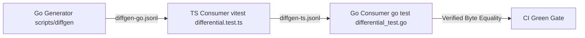

# Continuous Fuzzing & Protocol Assurance

This document details SendBeam's continuous fuzzing architecture, target inventory, seed corpora policy, crash reproduction workflows, and Google OSS-Fuzz integration guidelines.

---

## 1. Security Invariants & Fuzzing Philosophy

SendBeam processes untrusted network frames, invite tokens, pairing ceremonies, cryptographic revocation records, and serialized transfer journals. Point-in-time unit testing is insufficient for hostile network inputs. SendBeam enforces **continuous machine verification**:

1. **Memory Safety & Zero Panics:** No untrusted byte sequence or malformed JSON envelope may cause a panic, nil-pointer dereference, integer overflow, out-of-bounds index, or unbounded memory allocation.
2. **Strict Fail-Closed Behavior:** Any corrupted, truncated, torn, tampered, or schema-violating payload must be rejected cleanly with a structured error.
3. **No Partial Application:** Deserialization routines (such as ADR-0004 durable transfer journals) must never partially modify or commit state before completing full cryptographic and checksum validation.
4. **Lossless Round-Trip Integrity:** Any message or frame that successfully passes validation must re-encode and re-decode deterministically without loss of semantic fidelity.

---

## 2. Fuzz Target Inventory

Every codec, parser, and envelope decoder exposed to external bytes is covered by a dedicated Go native fuzz target (`Fuzz*`):

| Subsystem         | Package Path                  | Fuzz Target                   | Untrusted Surface Tested          | Core Invariants                                                    |
| :---------------- | :---------------------------- | :---------------------------- | :-------------------------------- | :----------------------------------------------------------------- |
| **Wire Protocol** | `packages/wire`               | `FuzzDecodeControl`           | JSON transfer control frames      | Valid frames round-trip; no parser panics                          |
| **Wire Protocol** | `packages/wire`               | `FuzzDecodeFrameHeader`       | 16-byte binary frame header       | Bounds check `< 16` bytes; round-trip                              |
| **Wire Protocol** | `packages/wire`               | `FuzzOpenSequenced`           | AEAD sealed frames (AES-GCM)      | Forged/truncated frames fail closed; length matches                |
| **Wire Protocol** | `packages/wire`               | `FuzzValidateManifest`        | Transfer manifest structure       | Rejects path escapes, overflow total sizes, negative blocks        |
| **Wire Protocol** | `packages/wire`               | `FuzzDecodeManifestShape`     | Arbitrary JSON array envelopes    | No unbounded slice allocations on huge JSON lists                  |
| **Wire Protocol** | `packages/wire`               | `FuzzNormalizeTransferPath`   | File paths from peer manifest     | Rejects traversal (`..`), absolute paths, Windows drive letters    |
| **Wire Protocol** | `packages/wire`               | `FuzzPaddingCodec`            | Power-of-2 bucket padding         | Rejects non-zero padding bytes; round-trip preserves plaintext     |
| **Wire Protocol** | `packages/wire`               | `FuzzRevocationRecord`        | Ed25519 revocation statements     | Rejects self-revocations, seq=0, bad signatures, clock skew        |
| **Wire Protocol** | `packages/wire`               | `FuzzPairingMessage`          | SPAKE2+ pairwise pairing frames   | Validates nonces, device binding; round-trip preserves types       |
| **Wire Protocol** | `packages/wire`               | `FuzzTrustedAuthMessage`      | Mutual authentication frames      | Deterministic capability hashing & sorted intersection             |
| **Wire Protocol** | `packages/wire`               | `FuzzDecodeJournal`           | ADR-0004 durable transfer state   | Rejects checksum/fingerprint mismatches; fails closed              |
| **Wire Protocol** | `packages/wire`               | `FuzzWordsCode`               | Invite codes (`<room>-<words>`)   | Lowercases, collapses punctuation; idempotent normalization        |
| **Engine**        | `packages/engine/rendezvous`  | `FuzzUnmarshalMessage`        | WebSocket signaling envelopes     | Valid frames round-trip; handles unknown types safely              |
| **Engine**        | `packages/engine/transfer`    | `FuzzDurableJournalApply`     | Resumable journal load on disk    | Corrupted journal on disk is preserved (never deleted/overwritten) |
| **Engine**        | `packages/engine/trust`       | `FuzzDecodeTrustRecord`       | Local trust database record       | Verifies DeviceID matches public key derivation; valid timestamps  |
| **Engine**        | `packages/engine/trust`       | `FuzzFileTrustStoreLoad`      | `trust.json` file on disk         | Corrupt file fails closed without modifying directory              |
| **Engine**        | `packages/engine/updater`     | `FuzzParseChannelManifest`    | Release channel update manifest   | Validates semver tags; safe platform artifact lookups              |
| **Engine**        | `packages/engine/updater`     | `FuzzParseChecksums`          | `SHA256SUMS.txt` manifest parser  | Rejects invalid hex lengths; extracts non-empty filenames          |
| **Server**        | `apps/server/internal/signal` | `FuzzClientMsg`               | Inbound client WebSocket frame    | Empty types rejected; type/room/role/bytes parsed safely           |
| **Server**        | `apps/server/internal/signal` | `FuzzServerMessageValidation` | Signaling message dispatch        | Safe frame formatting; bounds on room numbers and roles            |
| **Server**        | `apps/server/internal/signal` | `FuzzParseTrustedProxies`     | Comma-separated CIDR/IP list      | Safely parses IPv4/IPv6 networks and bare IPs                      |
| **Server**        | `apps/server/internal/signal` | `FuzzClientIP`                | Proxy headers (`X-Forwarded-For`) | Rejects header spoofing; never panics on malformed IPs             |

---

## 3. Seed Corpora Policy

Go native fuzzing loads seed inputs from two complementary sources:

1. **In-Memory Programmatic Seeds (`f.Add`):**
   - Every target registers baseline valid envelopes, empty inputs, edge cases (0, 1, max uint16), and malformed structures directly in code.
2. **Committed Seed Corpora (`testdata/fuzz/<Target>/`):**
   - Seed corpora are generated from canonical cross-language test vectors (`packages/wire/testdata/*-vectors.json` and `docs/test-vectors/*.json`).
   - Stored under the Go standard `<pkg>/testdata/fuzz/<TargetName>/<sha256>` format.
   - Committed directly into Git so that regression checks gate every developer test run and CI build.
   - Can be re-generated or updated at any time using:
     ```bash
     go run scripts/generate-fuzz-corpora.go
     ```

---

## 4. Running Fuzzers Locally

SendBeam provides `just` recipes and runner scripts mirroring the CI environment:

### A. Fast Smoke Pass (Corpus Replay)

To replay all committed seed corpora across every subsystem in seconds:

```bash
just fuzz-smoke
```

_(Or invoke `./scripts/run_fuzz.sh smoke` directly)._

### B. Active Mutation Fuzzing

To run active mutation fuzzing across all targets for a bounded duration (default 10s each):

```bash
just fuzz time=15s
```

To run active fuzzing on a single target for an extended duration:

```bash
just fuzz time=5m target=FuzzPaddingCodec
```

---

## 5. Continuous CI Fuzzing

### A. Pull Request Gate (`ci.yml`)

Every commit and pull request executes a corpus replay smoke pass:

```yaml
- name: Fuzz smoke (corpus replay)
  run: go test -run='^Fuzz' -v ./...
```

This ensures that any regression against previously discovered edge cases or crashing inputs blocks merging immediately.

### B. Scheduled Nightly Pipeline (`.github/workflows/fuzz.yml`)

A dedicated nightly workflow runs matrix-parallel across all 22 fuzz targets:

- **Schedule:** Daily at `02:00 UTC` (and via manual `workflow_dispatch`).
- **Duration:** 3–10 minutes per target in parallel.
- **Failure Handling:** If a fuzzer discovers a crash, Go writes the crashing input to `testdata/fuzz/<target>/`. The workflow catches the failure, automatically uploads the crashing testcase and stack trace as an artifact (`fuzz-crash-<target>`), and fails loudly.

---

## 6. Reproducing and Triaging Crashes

When a crash is reported by CI or an external security researcher:

1. **Download Crashing Artifact:**
   Extract the artifact file (e.g. `<hash>`) into the target's corpus directory:
   ```bash
   mkdir -p packages/wire/testdata/fuzz/FuzzPaddingCodec/
   mv <hash> packages/wire/testdata/fuzz/FuzzPaddingCodec/
   ```
2. **Reproduce Deterministically:**
   Run the target in standard test mode (no `-fuzz` flag needed; Go automatically executes all corpus entries):
   ```bash
   cd packages/wire
   go test -run='^FuzzPaddingCodec$' -v .
   ```
   The test will fail immediately on the crashing input and print the exact stack trace and line number.
3. **Minimize Input (Optional):**
   Run with `-fuzz` for a few seconds to let Go minimize the crashing payload:
   ```bash
   go test -fuzz='^FuzzPaddingCodec$' -fuzztime=10s .
   ```
4. **Fix and Commit Regression Test:**
   Implement the fix in the codec/parser. Keep the minimized crashing input committed under `testdata/fuzz/<target>/` to ensure permanent regression protection.

---

## 7. Security Disclosure Flow

If fuzzing uncovers a vulnerability with security impact (e.g., cryptographic bypass, remote denial of service, or memory exhaustion):

1. **Do not open a public issue.**
2. Report the vulnerability privately per [`SECURITY.md`](../SECURITY.md).
3. The maintainers will triage the issue, patch the defect, commit the regression corpus entry, and issue an advisory within the SLA defined in the security policy.

---

## 8. Google OSS-Fuzz Integration

SendBeam is prepared for onboarding into Google's [OSS-Fuzz](https://github.com/google/oss-fuzz) free service for continuous infrastructure fuzzing.

### Build Script

The repository provides [`scripts/oss-fuzz-build.sh`](../scripts/oss-fuzz-build.sh) which conforms to Google OSS-Fuzz requirements:

- Supports the OSS-Fuzz `compile_go_fuzzer` compiler wrapper.
- Automatically packages seed corpora into `<target>_seed_corpus.zip`.
- Runs standalone for local validation.

### Onboarding Application Steps

1. Fork [google/oss-fuzz](https://github.com/google/oss-fuzz).
2. Create directory `projects/sendbeam/`:
   - `project.yaml`: Maintainer emails, homepage (`https://github.com/Akshay7273/sendbeam`), primary language (`go`).
   - `Dockerfile`: Base Go image pulling `github.com/Akshay7273/sendbeam`.
   - `build.sh`: Symlinked or invoking `scripts/oss-fuzz-build.sh`.
3. Test locally using the OSS-Fuzz helper tool:
   ```bash
   python infra/helper.py build_fuzzers sendbeam
   python infra/helper.py run_fuzzer sendbeam fuzz_padding_codec
   ```
4. Submit PR to `google/oss-fuzz`. Once merged, Google ClusterFuzz continuously fuzzes SendBeam on dedicated CPU clusters with automated bug filing.

---

## 9. Cross-Language Differential Parity Testing (Go ↔ TypeScript)

While point-in-time test vectors (`testdata/*-vectors.json`) assert agreed-upon baseline cases, differential testing verifies that SendBeam's dual implementations (Go `packages/wire` and TypeScript `packages/protocol`) behave identically across an infinite range of pseudo-random, edge, and boundary inputs.



### Tested Codec Surfaces

The differential harness exercises all shared wire codecs across 8 distinct categories:

1. **Binary Frame Headers (16 bytes):** Big-endian layout, version, type, flags, file index, block index, frame offset, and payload length limits.
2. **Padding Codec:** Power-of-2 bucket sizing, 2-byte length prefixes, non-zero padding byte rejection, and lossless round-trip recovery.
3. **Control Messages:** JSON envelopes (`Manifest`, `Ack`, `Nack`, `Control`, `Complete`, `Done`, `Fail`, `ResumeState`) with identical key sequences and Unicode/HTML character preserving.
4. **Revocation Statements:** Canonical binary challenge building (`DomainRevocationRecord || revoker || revoked || seq || timestamp`), Ed25519 signatures, and structural validity.
5. **SPAKE2+ Pairing Ceremony:** Request/response challenge building, lexicographically-sorted HKDF credential derivation (`k_pair`, `cred_ref`), and mutual HMAC confirmation tags.
6. **Trusted-Session Authentication:** Canonical capability hashing (`hashCapabilities`), sorted capability intersection (`intersectCapabilities`), session challenges, and confirmation tags.
7. **Invite Codes & Normalization:** Alphanumeric casing, punctuation collapsing, rune mapping (`normalizeCode`), and parsing (`parseCode`).
8. **Safe Manifest Paths:** Directory traversal containment (`..`), root and absolute path rejection, Windows drive letter and reserved device name sanitization.

### Running Differential Testing Locally

Run the complete cross-language differential suite in both directions:

```bash
# Run with default 1,000 cases per codec
just differential

# Or with custom case count and seed
just differential count=5000 seed=42
```

Or invoke the runner script directly:

```bash
./scripts/run_differential.sh [count] [seed]
```

### Determinism & Crash Reproduction

Every test case emitted by the generators carries its pseudo-random `seed` and unique `case_id` (e.g. `fh_edge_0`, `pad_boundary_3`, `ta_42`). If a failure or divergence occurs:

1. The harness logs the failing `case_id`, `category`, and `seed`.
2. Developers can re-run with the exact same seed to reproduce the failure deterministically.
3. Any genuine divergence discovered is resolved, with the offending vector promoted to the permanent static vectors under `packages/wire/testdata/`.
