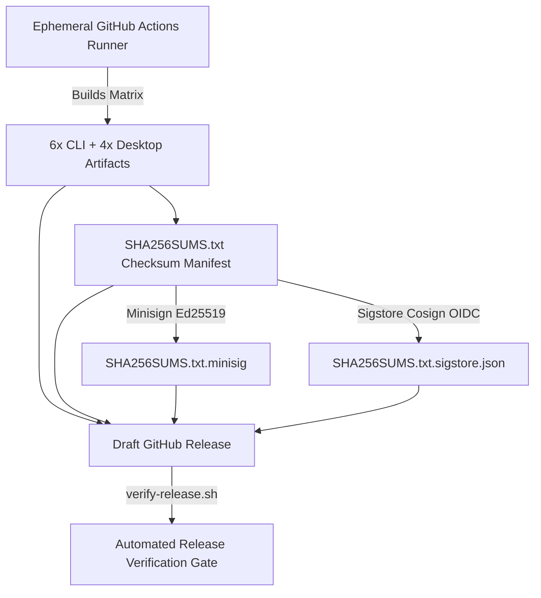

# Supply Chain Integrity & Attestations

This document describes SendBeam's software supply chain security architecture, cryptographic build provenance, Software Bill of Materials (SBOM) generation, and CI validation invariants.

---

## 1. Threat Model & Security Invariants

| Attack Vector                                            | Countermeasure                                                                                         | Verification Mechanism                                                                                |
| :------------------------------------------------------- | :----------------------------------------------------------------------------------------------------- | :---------------------------------------------------------------------------------------------------- |
| **Tampered Build Artifacts**                             | Artifacts built exclusively on ephemeral GitHub-hosted runners; strict linear commit history required. | GitHub Build-Provenance Attestations (`actions/attest-build-provenance@v2`).                          |
| **Release Manifest Tampering**                           | Checksum manifest signed with Minisign Ed25519 and Sigstore Cosign keyless OIDC.                       | Dual cryptographic signature verification (`SHA256SUMS.txt.minisig`, `SHA256SUMS.txt.sigstore.json`). |
| **Dependency Confusion / Malicious Transitive Packages** | Frozen dependencies in `go.sum` and `pnpm-lock.yaml`; automated SPDX 2.3 SBOM generation.              | SPDX SBOM manifests (`sendbeam-cli.spdx.json`, `sendbeam-desktop.spdx.json`) attested in CI.          |
| **Forged Checksums**                                     | SHA-256 checksum manifest (`SHA256SUMS.txt`) generated strictly inside the CI manifest workflow.       | Pre-distribution and post-distribution checksum verification gates.                                   |
| **Attribution & Committer Spoofing**                     | Strict CI gate rejecting automated agent attribution trailers and enforcing Conventional Commits.      | `metadata & attribution hygiene` status check in `ci.yml`.                                            |
| **Over-Privileged CI Workflows**                         | Default `permissions: contents: read` with least-privilege explicit scopes per job.                    | Explicit job-level permissions (`id-token: write`, `attestations: write`, `packages: write`).         |

---

## 2. Zero-Cost Cryptographic Signing Architecture

SendBeam implements a zero-cost, dual-signature model ensuring every release asset is cryptographically authenticated and non-repudiable without commercial code-signing certificate fees:



### A. Minisign (Ed25519)

- **Release Public Key:**
  ```text
  untrusted comment: minisign public key BA67BC598735C8DC
  RWTcyDWHWbxnuo3LVM5mWoZrx0HDwSQzAZvXK1lPRcdtJxshUDxJh+rE
  ```
- **Signing Invariant:** The private key is held exclusively as a GitHub Actions secret (`MINISIGN_SECRET_KEY`). The signature over `SHA256SUMS.txt` cryptographically commits to every release asset.
- **Fail-Closed CI Policy:** The release packaging workflow (`.github/workflows/release.yml`) fails closed if `MINISIGN_SECRET_KEY` is not present when drafting a release. Non-release CI builds are explicitly labeled `unsigned-dev` in version metadata.

### B. Sigstore Cosign (Keyless OIDC)

- **Identity Attestation:** Uses GitHub Actions OIDC identity token (`actions/attest-build-provenance` / `cosign sign-blob`) binding the artifact manifest directly to the authoritative repository (`github.com/Akshay7273/sendbeam`) and workflow.
- **Signature Bundle:** Attached to release as `SHA256SUMS.txt.sigstore.json`.
- **Zero Key Management:** Cryptographic certificates are short-lived and recorded on the public Rekor transparency log.

---

## 3. Cryptographic Build Provenance

SendBeam produces verifiable in-toto build provenance attestations for all compiled binaries, packages, and container images:

1. **Standalone Binaries & Distribution Packages:**
   - Multi-platform CLI archives (`linux/amd64`, `linux/arm64`, `darwin/amd64`, `darwin/arm64`, `windows/amd64`, `windows/arm64`).
   - Desktop installers and bundles (`.dmg`, `.zip`, `.exe`, `.deb`, `.AppImage`).
   - Attested via `actions/attest-build-provenance@v2` with Sigstore/GitHub OIDC identity tokens.

2. **Container Images:**
   - Multi-arch Docker images (`linux/amd64`, `linux/arm64`) published to GHCR (`ghcr.io/akshay7273/sendbeam`).
   - Built with Buildx `provenance: mode=max` and `sbom: true`.

---

## 4. Software Bill of Materials (SBOM)

Standard SPDX 2.3 JSON SBOM documents are generated automatically during CI packaging via `scripts/generate-sbom.sh`:

- **CLI SBOM:** `sendbeam-cli.spdx.json`
- **Desktop SBOM:** `sendbeam-desktop.spdx.json`

### SPDX 2.3 Structure

Each SBOM document includes:

- `spdxVersion`: `"SPDX-2.3"`
- `dataLicense`: `"CC0-1.0"`
- `SPDXID`: Root document and package identifiers (`SPDXRef-DOCUMENT`, `SPDXRef-Package-sendbeam-cli`)
- Component package information: package name, version, license declaration, repository download location, and supplier identity.
- Relationship graph: `SPDXRef-DOCUMENT DESCRIBES SPDXRef-Package-...` and `SPDXRef-Package-... DEPENDS_ON <dependency>`.

---

## 5. Verification Commands

Users and package maintainers can verify release assets using the following commands:

```bash
# 1. Verify Minisign signature over the checksum manifest:
minisign -Vm SHA256SUMS.txt -P RWTcyDWHWbxnuo3LVM5mWoZrx0HDwSQzAZvXK1lPRcdtJxshUDxJh+rE

# 2. Verify Sigstore Cosign OIDC bundle:
cosign verify-blob \
  --bundle SHA256SUMS.txt.sigstore.json \
  --certificate-identity-regexp 'github.com/Akshay7273/sendbeam' \
  --certificate-oidc-issuer https://token.actions.githubusercontent.com \
  SHA256SUMS.txt

# 3. Verify asset checksums against the signed manifest:
sha256sum -c SHA256SUMS.txt --ignore-missing

# Or run the automated all-in-one verification script:
./scripts/verify-release.sh --dir <release-dir> --pubkey minisign.pub
```

---

## 6. Key Rotation & Security Policy

1. **Minisign Key Rotation:**
   - In the event of secret key compromise or scheduled key rotation, a new Ed25519 keypair is generated via `go run ./scripts/minisign.go keygen`.
   - The updated public key is committed to `minisign.pub` and documented in release notes.
   - Previous releases remain verifiable against their historical public keys.
2. **Platform Code Signing Deferral (Authenticode & Apple Notarization):**
   - Microsoft Authenticode and Apple Developer ID signing/notarization are intentionally deferred until dedicated project funding is established ($0 budget milestone).
   - Desktop application binaries on macOS and Windows rely on transparent cryptographic checksums, Minisign signatures, and Sigstore OIDC attestations. Users follow standard OS security prompts (macOS Gatekeeper right-click-Open; Windows SmartScreen "More info → Run anyway") after verifying signatures.

---

## 7. OpenSSF Scorecard & SHA-Pinned Actions Policy

To protect SendBeam against supply-chain injection, workflow poisoning, and mutable tag hijacking, every third-party GitHub Action across all repository workflows is pinned to an immutable 40-character commit SHA accompanied by a human-readable version comment.

### Pinned Action Reference Matrix

| GitHub Action                       | Pinned Commit SHA                          | Tag / Release Reference | Purpose                                             |
| :---------------------------------- | :----------------------------------------- | :---------------------- | :-------------------------------------------------- |
| `actions/checkout`                  | `11bd71901bbe5b1630ceea73d27597364c9af683` | `v4.2.2`                | Workspace repository checkout                       |
| `actions/setup-go`                  | `f111f3307d8850f501ac008e886eec1fd1932a34` | `v5.3.0`                | Go toolchain setup and module caching               |
| `actions/setup-node`                | `1d0ff469b7ec7b3cb9d8673fde0c81c44821de2a` | `v4.2.0`                | Node.js and Corepack/pnpm setup                     |
| `actions/upload-artifact`           | `4cec3d8aa04e39d1a68397de0c4cd6fb9dce8ec1` | `v4.6.1`                | Ephemeral CI artifact staging                       |
| `actions/download-artifact`         | `cc203385981b70ca67e1cc392babf9cc229d5806` | `v4.1.9`                | Artifact retrieval across matrix stages             |
| `actions/cache`                     | `d4323d4df104b026a6aa633fdb11d772146be0bf` | `v4.2.2`                | CGo, Minisign, and package cache acceleration       |
| `actions/attest-build-provenance`   | `c074443f1aee8d4aeeae555aebba3282517141b2` | `v2.2.3`                | Cryptographic SLSA build provenance attestations    |
| `actions/attest-sbom`               | `115c3be05ff3974bcbd596578934b3f9ce39bf68` | `v2.2.0`                | In-toto SPDX 2.3 SBOM attestation signing           |
| `golangci/golangci-lint-action`     | `9fae48acfc02a90574d7c304a1758ef9895495fa` | `v7.0.1`                | Static analysis lint gate in Go packages            |
| `docker/login-action`               | `9780b0c442fbb1117ed29e0efdff1e18412f7567` | `v3.3.0`                | Container registry OIDC authentication              |
| `docker/setup-qemu-action`          | `49b3bc8e6bdd4a60e6116a5414239cba5943d3cf` | `v3.2.0`                | Multi-architecture emulation support                |
| `docker/setup-buildx-action`        | `6524bf65af31da8d45b59e8c27de4bd072b392f5` | `v3.8.0`                | Docker Buildx builder instance configuration        |
| `docker/build-push-action`          | `b32b51a8eda65d6793cd0494a773d4f6bcef32dc` | `v6.11.0`               | Container compilation and GHCR image publishing     |
| `sigstore/cosign-installer`         | `d7d6bc7722e3daa8354c50bcb52f4837da5e9b6a` | `v3.8.1`                | Cosign binary installation for keyless OIDC signing |
| `ossf/scorecard-action`             | `f49aabe0b5af0936a0987cfb85d86b75731b0186` | `v2.4.1`                | OpenSSF Scorecard supply-chain analysis             |
| `github/codeql-action/upload-sarif` | `9e8d0789d4a0fa9ceb6b1738f7e269594bdd67f0` | `v3.28.9`               | SARIF upload to GitHub Code Scanning dashboard      |

### Scorecard Workflow (`.github/workflows/scorecard.yml`)

The OpenSSF Scorecard automated evaluator runs on weekly schedule (Saturdays 01:30 UTC), on pushes to `main`, and on demand via `workflow_dispatch`. Results are published to GitHub Security Code Scanning and indexed on `scorecard.dev`.

### Automated Dependency Audits & Dependabot

Dependency maintenance is governed by `.github/dependabot.yml`:

- **Weekly Cadence:** Runs every Monday at scheduled UTC offsets.
- **Noise Minimization:** Groups updates into package cohorts (`github-actions`, `npm` dev/prod dependencies, and Go module groups per package).
- **PR Ceiling:** Caps open PRs per ecosystem to prevent maintainer review fatigue.
- **Fail-Closed CI Integration:** Every Dependabot PR must pass the comprehensive CI gate suite (tests, typecheck, lint, differential parity, and E2E) before merge.

---

## 8. Branch Protection & Gating Rules

The authoritative branch (`main`) is protected by automated GitHub branch rulesets:

1. **Pull Request Requirement:** All changes must land via pull requests; direct pushes to `main` are disabled.
2. **Linear History:** Squash-merging or fast-forward rebasing is enforced; merge commits are disallowed.
3. **Required Status Checks:** Every pull request must pass all automated status checks before merge:
   - `CI/branding (legacy naming check)`
   - `CI/metadata & attribution hygiene`
   - `CI/packages/wire (vet, test, race, fuzz smoke)`
   - `CI/packages/engine (vet, test, race)`
   - `CI/apps/server (vet, test, race)`
   - `CI/apps/cli (vet, test, race)`
   - `CI/desktop (server gates, linux build)`
   - `CI/web (lint, typecheck, unit tests, svelte-check, build)`
   - `CI/differential parity (wire, pairing, auth, paths)`
   - `CI/e2e (chromium, firefox, webkit, mobile-webkit)`
   - `CI/container (build + smoke)`
   - `distribution/cli (darwin/amd64, darwin/arm64, linux/amd64, linux/arm64, windows/amd64, windows/arm64)`
   - `distribution/desktop (linux, macos, windows)`
   - `distribution/exact artifacts checklist`
   - `distribution/manifest & checksum verification`
4. **Attribution & Metadata Enforcement:** The `CI/metadata & attribution hygiene` check rejects AI co-authorship tags, auto-generated bot footers, and malformed commit summaries.
5. **No Force Pushes or Deletions:** Protected against history rewrites.

---

## 9. OpenSSF Best Practices Self-Certification

SendBeam tracks and adheres to the **OpenSSF Best Practices Badge** criteria (Passing level):

| Section            | Requirement              | Status | SendBeam Implementation / Evidence                                                              |
| :----------------- | :----------------------- | :----- | :---------------------------------------------------------------------------------------------- |
| **Basics**         | Open Source License      | Met    | MIT License (`LICENSE`)                                                                         |
| **Basics**         | Clear Documentation      | Met    | `README.md`, `docs/protocol.md`, `docs/threat-model.md`, `docs/HOSTING.md`                      |
| **Basics**         | Project Site & Live Demo | Met    | Hosted live demo at `omnitrix.space`                                                            |
| **Change Control** | Public Version Control   | Met    | Git repository on GitHub (`Akshay7273/sendbeam`)                                                |
| **Change Control** | Unique Version Tags      | Met    | SemVer tags (`v1.7.0`, `v1.8.0`) signed and published with release notes                        |
| **Reporting**      | Vulnerability Disclosure | Met    | `SECURITY.md` with GitHub Private Vulnerability Reporting and defined response SLAs             |
| **Quality**        | Automated Build & Test   | Met    | Comprehensive test runner (`just test`), unit, integration, and E2E suites                      |
| **Quality**        | Continuous Integration   | Met    | GitHub Actions workflow (`ci.yml`) runs on all PRs and commits with 22 required checks          |
| **Security**       | Strong Cryptography      | Met    | SPAKE2+ (RFC 9382), AES-256-GCM, Ed25519 signatures, Minisign, SHA-256                          |
| **Security**       | Safe Memory Handling     | Met    | Implemented in memory-safe languages (Go, TypeScript); strict buffer bounds                     |
| **Security**       | Dynamic & Fuzz Testing   | Met    | 22 Go native fuzz targets (`docs/fuzzing.md`), nightly matrix fuzzing, OSS-Fuzz build           |
| **Security**       | Differential Parity      | Met    | Cross-language test harness exercising Go and TS codecs over 2,000 cases per run                |
| **Security**       | Supply Chain Assurance   | Met    | SLSA Level 3 provenance, SPDX 2.3 SBOMs, Minisign signatures, Sigstore OIDC, SHA-pinned actions |
| **Analysis**       | Static Code Analysis     | Met    | `golangci-lint`, `go vet`, `svelte-check`, TypeScript compiler (`tsc`) enforced in CI           |
