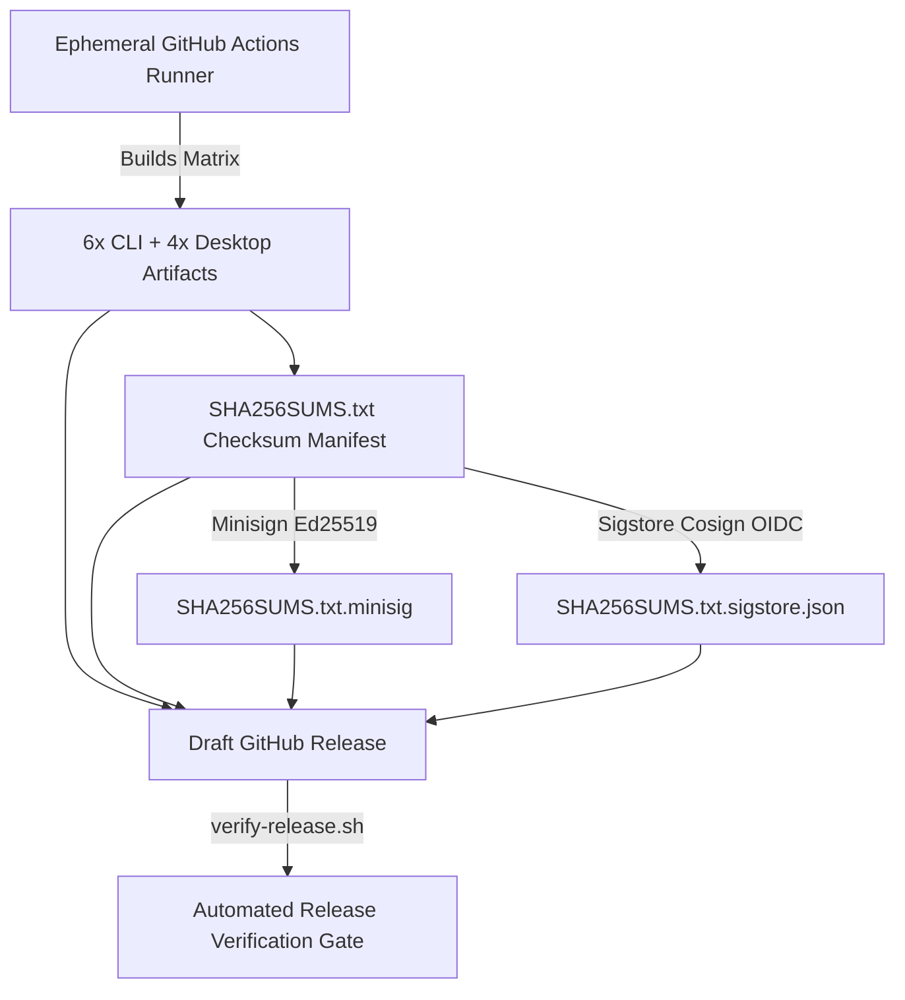

# Supply Chain Integrity & Attestations

This document describes SendBeam's software supply chain security architecture, cryptographic build provenance, Software Bill of Materials (SBOM) generation, and CI validation invariants.

---

## 1. Threat Model & Security Invariants

| Attack Vector                                            | Countermeasure                                                                                         | Verification Mechanism                                                                                |
| :------------------------------------------------------- | :----------------------------------------------------------------------------------------------------- | :---------------------------------------------------------------------------------------------------- |
| **Tampered Build Artifacts**                             | Artifacts built exclusively on ephemeral GitHub-hosted runners; strict linear commit history required. | GitHub Build-Provenance Attestations (`actions/attest-build-provenance@v2`).                          |
| **Release Manifest Tampering**                           | Checksum manifest signed with Minisign Ed25519 and Sigstore Cosign keyless OIDC.                       | Dual cryptographic signature verification (`SHA256SUMS.txt.minisig`, `SHA256SUMS.txt.sigstore.json`). |
| **Dependency Confusion / Malicious Transitive Packages** | Frozen dependencies in `go.sum` and `pnpm-lock.yaml`; automated SPDX 2.3 SBOM generation.              | SPDX SBOM manifests (`sendbeam-cli.spdx.json`, `sendbeam-desktop.spdx.json`) attested in CI.          |
| **Forged Checksums**                                     | SHA-256 checksum manifest (`SHA256SUMS.txt`) generated strictly inside the CI manifest workflow.       | Pre-distribution and post-distribution checksum verification gates.                                   |
| **Attribution & Committer Spoofing**                     | Strict CI gate rejecting automated agent attribution trailers and enforcing Conventional Commits.      | `metadata & attribution hygiene` status check in `ci.yml`.                                            |
| **Over-Privileged CI Workflows**                         | Default `permissions: contents: read` with least-privilege explicit scopes per job.                    | Explicit job-level permissions (`id-token: write`, `attestations: write`, `packages: write`).         |

---

## 2. Zero-Cost Cryptographic Signing Architecture

SendBeam implements a zero-cost, dual-signature model ensuring every release asset is cryptographically authenticated and non-repudiable without commercial code-signing certificate fees:



### A. Minisign (Ed25519)

- **Release Public Key:**
  ```text
  untrusted comment: minisign public key BA67BC598735C8DC
  RWTcyDWHWbxnuo3LVM5mWoZrx0HDwSQzAZvXK1lPRcdtJxshUDxJh+rE
  ```
- **Signing Invariant:** The private key is held exclusively as a GitHub Actions secret (`MINISIGN_SECRET_KEY`). The signature over `SHA256SUMS.txt` cryptographically commits to every release asset.
- **Fail-Closed CI Policy:** The release packaging workflow (`.github/workflows/release.yml`) fails closed if `MINISIGN_SECRET_KEY` is not present when drafting a release. Non-release CI builds are explicitly labeled `unsigned-dev` in version metadata.

### B. Sigstore Cosign (Keyless OIDC)

- **Identity Attestation:** Uses GitHub Actions OIDC identity token (`actions/attest-build-provenance` / `cosign sign-blob`) binding the artifact manifest directly to the authoritative repository (`github.com/Akshay7273/sendbeam`) and workflow.
- **Signature Bundle:** Attached to release as `SHA256SUMS.txt.sigstore.json`.
- **Zero Key Management:** Cryptographic certificates are short-lived and recorded on the public Rekor transparency log.

---

## 3. Cryptographic Build Provenance

SendBeam produces verifiable in-toto build provenance attestations for all compiled binaries, packages, and container images:

1. **Standalone Binaries & Distribution Packages:**
   - Multi-platform CLI archives (`linux/amd64`, `linux/arm64`, `darwin/amd64`, `darwin/arm64`, `windows/amd64`, `windows/arm64`).
   - Desktop installers and bundles (`.dmg`, `.zip`, `.exe`, `.deb`, `.AppImage`).
   - Attested via `actions/attest-build-provenance@v2` with Sigstore/GitHub OIDC identity tokens.

2. **Container Images:**
   - Multi-arch Docker images (`linux/amd64`, `linux/arm64`) published to GHCR (`ghcr.io/akshay7273/sendbeam`).
   - Built with Buildx `provenance: mode=max` and `sbom: true`.

---

## 4. Software Bill of Materials (SBOM)

Standard SPDX 2.3 JSON SBOM documents are generated automatically during CI packaging via `scripts/generate-sbom.sh`:

- **CLI SBOM:** `sendbeam-cli.spdx.json`
- **Desktop SBOM:** `sendbeam-desktop.spdx.json`

### SPDX 2.3 Structure

Each SBOM document includes:

- `spdxVersion`: `"SPDX-2.3"`
- `dataLicense`: `"CC0-1.0"`
- `SPDXID`: Root document and package identifiers (`SPDXRef-DOCUMENT`, `SPDXRef-Package-sendbeam-cli`)
- Component package information: package name, version, license declaration, repository download location, and supplier identity.
- Relationship graph: `SPDXRef-DOCUMENT DESCRIBES SPDXRef-Package-...` and `SPDXRef-Package-... DEPENDS_ON <dependency>`.

---

## 5. Verification Commands

Users and package maintainers can verify release assets using the following commands:

```bash
# 1. Verify Minisign signature over the checksum manifest:
minisign -Vm SHA256SUMS.txt -P RWTcyDWHWbxnuo3LVM5mWoZrx0HDwSQzAZvXK1lPRcdtJxshUDxJh+rE

# 2. Verify Sigstore Cosign OIDC bundle:
cosign verify-blob \
  --bundle SHA256SUMS.txt.sigstore.json \
  --certificate-identity-regexp 'github.com/Akshay7273/sendbeam' \
  --certificate-oidc-issuer https://token.actions.githubusercontent.com \
  SHA256SUMS.txt

# 3. Verify asset checksums against the signed manifest:
sha256sum -c SHA256SUMS.txt --ignore-missing

# Or run the automated all-in-one verification script:
./scripts/verify-release.sh --dir <release-dir> --pubkey minisign.pub
```

---

## 6. Key Rotation & Security Policy

1. **Minisign Key Rotation:**
   - In the event of secret key compromise or scheduled key rotation, a new Ed25519 keypair is generated via `go run ./scripts/minisign.go keygen`.
   - The updated public key is committed to `minisign.pub` and documented in release notes.
   - Previous releases remain verifiable against their historical public keys.
2. **Platform Code Signing Deferral (Authenticode & Apple Notarization):**
   - Microsoft Authenticode and Apple Developer ID signing/notarization are intentionally deferred until dedicated project funding is established ($0 budget milestone).
   - Desktop application binaries on macOS and Windows rely on transparent cryptographic checksums, Minisign signatures, and Sigstore OIDC attestations. Users follow standard OS security prompts (macOS Gatekeeper right-click-Open; Windows SmartScreen "More info → Run anyway") after verifying signatures.
