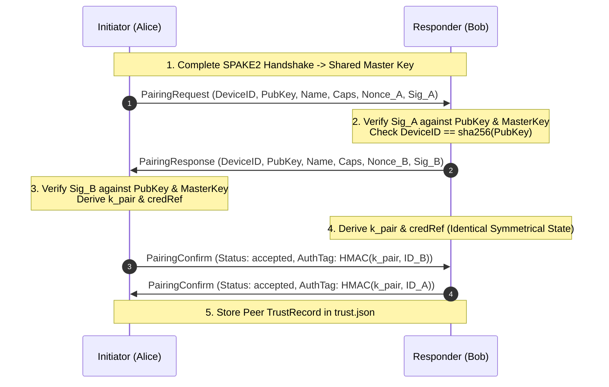
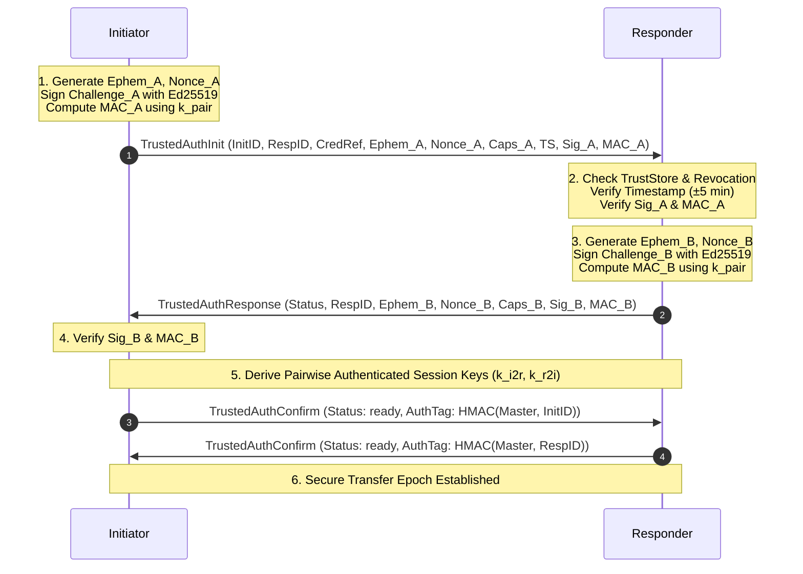

# Trust & Device Identity Model

Scope: SendBeam v1.5 introduces persistent device identity and trusted device mesh capabilities, allowing paired devices to authenticate each other and automate transfers without centralized accounts, global directories, or server-side file persistence.

---

## 1. Cryptographic Device Identity

Every SendBeam client generates and manages an independent, long-term cryptographic identity.

### 1.1 Key Material

- **Algorithm:** Ed25519 (`crypto/ed25519` in Go, `@noble/curves/ed25519` in TypeScript).
- **Public Key:** 32 bytes raw.
- **Private Key:** 32-byte private seed (never transmitted across any network boundary or exported into logs).

### 1.2 Canonical Device Identifier (`DeviceID`)

The `DeviceID` is an immutable, collision-resistant string derived deterministically from the public key:

```
DeviceID = "sb-dev-" || LowercaseHex(SHA-256(RawPublicKey[32]))
```

- **Length:** 71 characters (`sb-dev-` prefix + 64 hex characters).
- **Properties:** Universally unique, content-addressed to the public key, independent of human names or network addresses.

### 1.3 Human-Verifiable Fingerprint

For visual comparison and out-of-band out-of-screen verification:

```
Fingerprint = "SB1-" || FormatBase32_4x4(SHA-256(RawPublicKey[32])[0..10])
```

- **Example:** `SB1-MW3A-M46W-5WEE-X4A4`
- **Properties:** 80 bits of cryptographic pre-image resistance, grouped into 4 uppercase alphanumeric chunks for effortless visual inspection.

---

## 2. Key Storage & Protection

The private seed is protected locally according to the platform's security capabilities:

| Platform        | Storage Mechanism                        | Fallback / Degradation                                                    |
| :-------------- | :--------------------------------------- | :------------------------------------------------------------------------ |
| **macOS**       | Keychain Services / Protected File       | User-confined directory (`~/.config/sendbeam/identity.key`, `0600` perms) |
| **Windows**     | DPAPI / Protected File                   | User app data directory (`%APPDATA%\SendBeam\identity.key`, `0600` ACL)   |
| **Linux / BSD** | Secret Service API / Protected File      | User config directory (`~/.config/sendbeam/identity.key`, `0600` perms)   |
| **Browser**     | IndexedDB / WebCrypto non-exportable key | LocalStorage is strictly refused for raw private keys                     |

Silent downgrade to insecure plaintext persistence is forbidden.

---

## 3. Local Trust Database (`trust.json`)

Paired devices are recorded in a local versioned database containing identity bindings and policy parameters.

### 3.1 Record Schema

```json
{
  "device_id": "sb-dev-65b60673d6ed884bf01c2c222d82ada0740f29ac3355d6a925c81f17f47a27b8",
  "public_key": "79b5562e8fe654f94078b112e8a98ba7901f853ae695bed7e0e3910bad049664",
  "local_label": "Work Laptop (M3 Max)",
  "pair_credential_ref": "cred-78f9a20...",
  "capabilities": ["transfer.v1", "transfer.v2", "lan_direct", "auto_accept"],
  "first_seen_at": "2026-08-21T06:00:00Z",
  "last_seen_at": "2026-08-21T06:45:00Z",
  "revoked": false,
  "revoked_at": null,
  "policy": {
    "auto_accept": true,
    "auto_accept_dest_dir": "/home/user/Downloads/SendBeam",
    "max_file_size_bytes": 10737418240,
    "allowed_mime_types": []
  }
}
```

### 3.2 Atomicity & Concurrency Safety

- Writes use **atomic temporary files and renames** (`trust-*.tmp` → `trust.json`) with restricted permissions (`0600`).
- Process-level mutexes and cooperative file locks prevent concurrent read/write corruptions.

---

## 4. Trust Boundaries & Revocation Semantics

### 4.1 Local Revocation vs. Mesh Revocation Sync & Authorization Model (ADR 0008 & ADR 0010)

SendBeam operates strictly without centralized accounts, global directories, or central CRL servers.

- **Local Unpair / Revoke:** Revoking a device locally marks the trust record as revoked with `revoked: true`.
- **Signed Revocation Records & Mesh Revocation Sync (v1.7 / ADR 0008):** When a device revokes a peer, it signs a canonical, domain-separated statement:
  $$\text{RevocationRecord} = (\text{RevokerDeviceID}, \text{RevokedDeviceID}, \text{Seq}, \text{Timestamp}, \text{Signature})$$
  This record opportunistically propagates over authenticated trusted sessions. When other paired devices in the owner's mesh connect, they verify the Ed25519 signature against their stored public key for the revoker, validate monotonic sequence ordering, and automatically mark the revoked device as distrusted (`ErrUntrustedPeer` / `ErrTrustedPeerRevoked`).
- **Authorization Hierarchy ("Who May Revoke Whom", v1.9 / ADR 0010):**
  To prevent pairwise contacts from revoking third-party devices across an owner's mesh, revocation authority is strictly partitioned:
  1. _Self-Tombstones:_ Any device may revoke itself (`RevokerDeviceID == RevokedDeviceID`). Every paired peer accepts validly signed self-tombstones fail-closed.
  2. _Direct Pairwise Unpairing:_ Unpairing an external contact affects only that local pairwise relationship; external contacts have zero authority to emit transitive revocations for any third-party device (`ErrRevocationUnauthorized`).
  3. _Owner Device Clusters:_ Transitive multi-device revocation sync is strictly confined to devices in the same authenticated owner cluster (`relationship: "cluster_member"`). An owner cluster device may revoke other cluster members or drop external contacts cluster-wide.
- **Scope Honesty & Limitations:** Mesh revocation synchronization propagates distrust across mutual peers that connect to each other. It does not and cannot force an offline or compromised device to forget existing downloaded files or delete its local storage.

### 4.2 Display Names vs. Cryptographic Identity

- **Display labels are strictly local user metadata.** Display names transmitted over the wire are never used as a trust anchor.
- Authentication binds to the `DeviceID` (public key digest) and cryptographic signatures.

---

## 5. Auto-Accept Policy & Confinement

Automated transfers (e.g. CLI daemon or background desktop receiver) require strict safety bounds:

1. **Explicit Opt-in:** `auto_accept` defaults to `false`. It must be explicitly configured per-device.
2. **Absolute Destination Directory:** `auto_accept_dest_dir` must be an absolute path. Setting it to filesystem root (`/` or `C:\`) is strictly rejected.
3. **Path Sanitization:** File names are subject to strict relative path validation (`safe_path.go` / `safe-path.ts`) to prevent directory traversal or symlink escapes outside the designated destination root.
4. **Quota & Size Caps:** Incoming files exceeding `max_file_size_bytes` or available disk headroom abort before writing to disk.

---

## 6. One-Time Pairing Ceremony

The pairing ceremony bootstraps long-term pairwise trust through the existing SPAKE2 authenticated channel without requiring central servers.



### 6.1 Cryptographic Transcript Binding

- **Request Challenge:** `"sendbeam/1 pairing-request:" || SHA-256(MasterKey) || Nonce_A || DeviceID_A`
- **Response Challenge:** `"sendbeam/1 pairing-response:" || SHA-256(MasterKey) || Nonce_A || Nonce_B || DeviceID_B`
- Both signatures are signed with the device's private Ed25519 key.

### 6.2 Pair Credential Derivation (`k_pair`)

```
k_pair = HKDF-SHA256(
    IKM = MasterKey,
    Salt = Nonce_A || Nonce_B,
    Info = "sendbeam/1 pair-credential" || LexicographicalSort(PubKey_A, PubKey_B),
    Length = 32 bytes
)
PairCredentialRef = "cred-" || LowercaseHex(SHA-256(k_pair))
```

### 6.3 Re-Pairing & Conflict Mitigation

- **Legitimate Re-Pairing:** When a known device reconnects with the same cryptographic key, its local label, capabilities, and `LastSeenAt` timestamp are safely updated.
- **Key & Label Conflicts:**
  - If a pairing peer claims an active name already assigned to a different public key, the ceremony aborts with `ErrLabelConflict`.
  - Silent key overwrites are strictly forbidden to prevent impersonation attacks.

---

## 7. Trusted-Session Authentication (`sendbeam/2`)

Repeat connections between paired devices authenticate without human codes or passwords using mutual challenge-response verification over ephemeral key material.



### 7.1 Pairwise Authenticated Key Schedule (sendbeam/2 vs sendbeam/3)

> [!WARNING]
> **Forward Secrecy Limitation in Legacy `sendbeam/2`:**
> In the legacy v1.5 key schedule (`sendbeam/2`), `IKM` is derived via `HMAC-SHA256(k_pair, Ephem_A || Ephem_B || Nonce_A || Nonce_B)`. While this binds ephemeral nonces and mutual public parameters to authenticate both participants and prevent replay, it relies on symmetric authentication under `k_pair` without an ephemeral Diffie-Hellman (ECDH) exchange.
> Consequently, compromise of the long-term pairwise secret `k_pair` enables retroactive decryption of recorded past session traffic (it does **not** provide forward secrecy).

```
// Legacy sendbeam/2 key schedule (deprecated)
IKM = HMAC-SHA256(k_pair, Ephem_A || Ephem_B || Nonce_A || Nonce_B)
Salt = Nonce_A || Nonce_B
Transcript = "sendbeam/2 trusted-resp:" || SHA-256(k_pair) || Ephem_A || Ephem_B || Nonce_A || Nonce_B || InitID || RespID || SHA-256(NegotiatedCaps)

SessionMaster = HKDF-SHA256(IKM, Salt, "sendbeam/2 session-master:" || Transcript, 32)
k_i2r = HKDF-SHA256(SessionMaster, nil, "sendbeam/2 initiator-to-responder key", 32)
k_r2i = HKDF-SHA256(SessionMaster, nil, "sendbeam/2 responder-to-initiator key", 32)
```

### 7.2 Ephemeral Forward-Secret Key Exchange (`sendbeam/3` / ADR 0010)

SendBeam v1.9 defines **`sendbeam/3`** (full specification in [`docs/adr/0010-trusted-session-auth.md`](adr/0010-trusted-session-auth.md)), replacing legacy `sendbeam/2` with a true forward-secret authenticated ephemeral Diffie-Hellman key exchange:

1. **Ephemeral X25519 Agreement:** Both parties generate ephemeral Curve25519 keypairs ($(e_A, E_A)$ and $(e_B, E_B)$) and exchange them signed by their long-term Ed25519 identity keys and authenticated under $k_{pair}$.
2. **Shared Secret:**
   $$SS_{ECDH} = \text{X25519}(e_A, E_B) = \text{X25519}(e_B, E_A)$$
   Ephemeral scalars ($e_A, e_B$) are zeroized in memory immediately after computation.
3. **Hybrid Extraction:**
   $$\text{PRK} = \text{HKDF-Extract}(\text{salt} = k_{pair}, \text{IKM} = SS_{ECDH})$$
4. **Transcript & Expansion:**
   $$T = \text{"sendbeam/3 transcript:"} \parallel \text{SHA256}(k_{pair}) \parallel E_A \parallel E_B \parallel N_A \parallel N_B \parallel \text{InitID} \parallel \text{RespID} \parallel H_{caps}$$
   $$\text{SessionMaster} = \text{HKDF-Expand}(\text{PRK}, \text{"sendbeam/3 session-master:"} \parallel T, 32)$$
   $$k_{i2r} = \text{HKDF-Expand}(\text{SessionMaster}, \text{"sendbeam/3 initiator-to-responder key"}, 32)$$
   $$k_{r2i} = \text{HKDF-Expand}(\text{SessionMaster}, \text{"sendbeam/3 responder-to-initiator key"}, 32)$$
5. **Mutual Confirmation:** Initiator sends $\text{HMAC}(\text{SessionMaster}, \text{"sendbeam/3 confirm-init:"} \parallel \text{InitID})$; responder sends $\text{HMAC}(\text{SessionMaster}, \text{"sendbeam/3 confirm-resp:"} \parallel \text{RespID})$.

### 7.3 Replay, Revocation & Downgrade Enforcement

- **Timestamp Skew Bounding:** Timestamps outside ±5 minutes are rejected immediately (`ErrTrustedTimestampSkew`).
- **Cryptographic Binding:** The signature and MAC tag strictly bind $k_{pair}$, ephemeral public keys, nonces, device IDs, and negotiated capabilities.
- **Local Revocation & Tombstones:** If a peer has been marked `revoked: true` or matches a persistent tombstone, connection attempts are rejected with `ErrTrustedPeerRevoked`.
- **Downgrade Rejection:** Paired devices must negotiate `sendbeam/3`; any downgrade attempt to `sendbeam/2` or `sendbeam/1` is rejected fail-closed with `ErrProtocolDowngradeForbidden`.
- **Protocol Boundary:** One-time pairing and room-code transfers remain compatible via `sendbeam/1`, while trusted-device handoffs require `sendbeam/3`.

---

## 8. Privacy-Preserving Remote Presence & LAN Discovery

SendBeam allows paired devices to discover each other across the internet and local networks without leaking device identities, filenames, user accounts, or global directories.

### 8.1 Opaque Epoch-Rotated Rendezvous Handles

To discover peers over the signaling server without creating a global directory or publishing device IDs:

- **Pairwise Time-Windowed Handle Derivation:**
  ```
  epochIndex = floor(unixTimestampSeconds / 900)  // 15-minute epoch window
  handle = HMAC-SHA256(k_pair, "sendbeam/2 rendezvous-handle:" || epochIndex)
  ```
- **Clock Drift Tolerance:** Clients compute candidate handles for `[epochIndex-1, epochIndex, epochIndex+1]` to tolerate clock skew.
- **Server Privacy & Limits:** The signaling server matches connections solely on exact handle equality. The server cannot determine which devices share a handle or link different epoch handles together from the handle alone. However, opaque handles do **not** provide network-level anonymity: the signaling server and network observers still observe client IP addresses, TCP/WebSocket connection metadata, and message timing.

### 8.2 Blinded LAN Discovery Beacons

For local network (Wi-Fi/LAN) direct transfer without internet roundtrips:

- **Beacon Frame Format:**
  - Header (32 bytes): Magic `"SB2B"`, Version `1`, TCP Listening Port (2 bytes), Timestamp (8 bytes), Nonce (16 bytes), Tag Count (1 byte).
  - Tags: Up to 32 truncated 16-byte blinded tags.
- **Blinded Tag Formula:**
  ```
  tag = HMAC-SHA256(k_pair, "sendbeam/2 lan-beacon:" || Nonce || epochIndex)[0:16]
  ```
- **Local Matching:** Listening nodes compute candidate tags using `k_pair` secrets from their local trust stores. Unpaired third parties on the LAN only see pseudorandom bytes.
- **Direct LAN Connection:** When a peer is matched on LAN, nodes connect directly via TCP/TLS, bypassing internet signaling and relay.

---

## 9. CLI Automation & Mesh Operations

The `sendbeam` CLI provides scriptable trusted-device operations:

- `sendbeam devices [--json]`: Lists all paired devices with fingerprint, authorization policy, and last authenticated contact.
- `sendbeam pair [code] [--name <label>] [--auto-accept --dest <dir>]`: Runs the mutual pairing ceremony over one-time SPAKE2 room codes.
- `sendbeam unpair <device> [--yes] [--purge]`: Revokes or purges trust credentials for a specified device ID, label, or fingerprint.
- `sendbeam send <paths...> @<device>`: Directly transfers files to a trusted device without human room codes or interactive prompts.
- `sendbeam listen [--dest <dir>] [--auto-accept] [--once]`: Background daemon listening for incoming LAN discovery beacons and opaque rendezvous presence.

---

## 10. Browser Participation & Capability Gating

Browser clients participate in persistent trusted-device mesh operations under strictly defined security boundaries:

- **Capability Gating:** Persistent pairing is enabled only when functional WebCrypto subtle (`crypto.subtle`) and IndexedDB storage (`window.indexedDB`) are available. In restricted browsing contexts (e.g. non-HTTPS, disabled storage), SendBeam cleanly disables persistent trust and preserves one-time room code transfers without faking support via insecure plaintext `localStorage` or cookies.
- **IndexedDB Isolation:** Device identities (`sendbeam-identity`), trust database records (`sendbeam-trust`), and pair credentials (`sendbeam-secrets`) are scoped to the browser origin.
- **Site Data Lifetime:** Clearing browsing data or cookies predictably revokes all local paired credentials.
- **UI Differentiation:** The UI explicitly displays browser storage notices and clarifies that browser identities are local to that specific browser profile.

---

## 11. Attack Matrix & Adversarial Security Guarantees

SendBeam v1.5 enforces formal mitigations against 9 core attack vectors across native and browser engines:

| Attack Vector                    | Threat Scenario                                                         | Mitigation & Security Guarantee                                                                                                           |
| :------------------------------- | :---------------------------------------------------------------------- | :---------------------------------------------------------------------------------------------------------------------------------------- |
| **1. Stolen Trust DB**           | Attacker substitutes public key in victim's local database.             | `ValidateTrustRecord` and challenge verification strictly require `deriveDeviceId(pubKey) == deviceId` and authentic signatures.          |
| **2. Replay & Cloned Profile**   | Attacker replays captured `TrustedAuthInit` message.                    | Replay fails due to fresh ephemeral nonces, timestamp skew bounds (±5 min), and domain-separated transcripts.                             |
| **3. Malicious Server MITM**     | Signaling or relay server modifies ephemeral keys in transit.           | Transcript signature and HMAC verification across full payload fail; connection terminates before key derivation.                         |
| **4. Presence Replay**           | Attacker replays LAN beacon tags or rendezvous handles.                 | Handles and tags expire every 15-minute epoch window; historical beacons (>1 epoch old) are rejected.                                     |
| **5. Display Name Spoofing**     | Adversary assumes friendly label of a paired peer.                      | Local labels are advisory only; identity is authenticated strictly by Ed25519 public key and DeviceID fingerprint.                        |
| **6. Downgrade Attack**          | MITM attempts to strip `sendbeam/2` trusted auth flags.                 | Capability set is cryptographically hashed and bound into the transcript; tampering causes handshake failure.                             |
| **7. Stale/Revoked Credentials** | Unpaired or revoked device attempts connection.                         | `store.IsTrusted()` check rejects revoked peers before session establishment; secrets are purged on unpair.                               |
| **8. Auto-Accept Escape**        | Malicious peer sends `../../etc/passwd` in auto-accept mode.            | `NormalizeTransferPath` strictly enforces safe relative paths within designated destination root.                                         |
| **9. One-Time Isolation**        | Standard one-time transfer executes between devices.                    | One-time transfers never mutate trust database or persist credentials without explicit mutual pairing.                                    |
| **10. Forged Revocation Record** | Attacker claims peer revoked another device.                            | Ed25519 signature verification against stored revoker public key fails; record is rejected fail-closed.                                   |
| **11. Revocation Seq Rollback**  | Attacker replays older revocation sequence number.                      | Monotonic `Seq` enforcement rejects lower or identical sequence numbers (`Seq <= StoredSeq`).                                             |
| **12. Revoked Peer Submitting**  | Already-distrusted device attempts to submit revocations.               | Ingestion rule checks `store.IsTrusted(RevokerID)` and rejects records from distrusted devices fail-closed.                               |
| **13. Unauthorized Revocation**  | External contact attempts to revoke third-party device in mesh.         | Scope authorization check rejects transitive claims from non-cluster peers fail-closed (`ErrRevocationUnauthorized`, ADR 0010).           |
| **14. Protocol Downgrade**       | Attacker attempts to force `sendbeam/2` or `sendbeam/1` on paired peer. | Strict protocol negotiation mandates `sendbeam/3` for paired devices; downgrades fail closed (`ErrProtocolDowngradeForbidden`, ADR 0010). |
