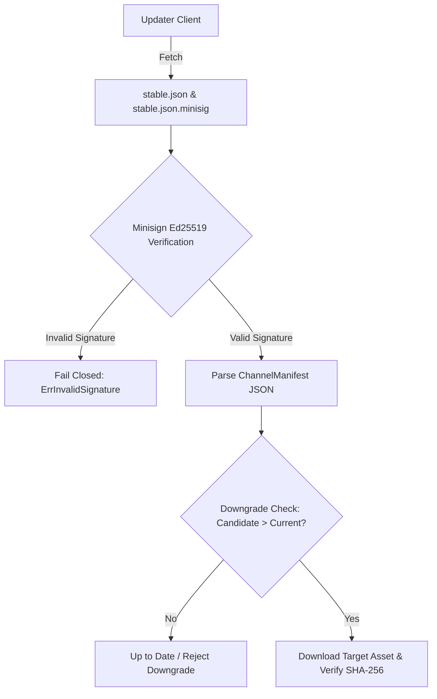
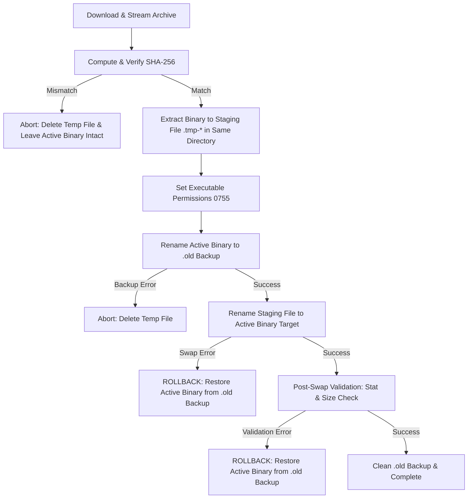

# SendBeam Updater & Rollback Architecture

This document describes SendBeam's self-update engine, distribution channels, cryptographic verification, atomic file replacement, and automatic rollback mechanisms.

---

## 1. Overview

SendBeam provides a framework-independent Go updater engine (`packages/engine/updater`) shared by the CLI (`sendbeam update`) and desktop application (`UpdateService`). The updater ensures that standalone binaries, Linux AppImages, macOS `.app` bundles, and Windows installers can safely upgrade without compromising runtime integrity, corrupting active installations, or exposing users to downgrade attacks.

---

## 2. Distribution Channels & Production Endpoints

SendBeam defines three formal distribution channels hosted on GitHub Pages:

| Channel                | Description                    | Production Endpoint Manifest                                | Allowed Release Types                                 | Downgrade / Prerelease Rule                                                        |
| :--------------------- | :----------------------------- | :---------------------------------------------------------- | :---------------------------------------------------- | :--------------------------------------------------------------------------------- |
| **`stable`** (Default) | Official production releases.  | `https://akshay7273.github.io/sendbeam/updates/stable.json` | Stable releases only (`vX.Y.Z`).                      | **Never** checks or applies prereleases, beta builds, or RC tags.                  |
| **`beta`**             | Early-access candidate builds. | `https://akshay7273.github.io/sendbeam/updates/beta.json`   | Stable + Prerelease (`vX.Y.Z-beta.N`, `vX.Y.Z-rc.N`). | Tracks both stable and candidate builds.                                           |
| **`dev`**              | Local / development builds.    | —                                                           | Untagged / `dev` versions.                            | Informs user they are on a dev build; automated updates are skipped unless forced. |

---

## 3. Cryptographic Manifest Verification & Security Invariants

Every update manifest is cryptographically authenticated prior to parsing or processing:



### Pinned Release Key

- **Pinned Minisign Public Key:**
  ```text
  RWTcyDWHWbxnuo3LVM5mWoZrx0HDwSQzAZvXK1lPRcdtJxshUDxJh+rE
  ```
- **Manifest Pre-Verification Invariant:** The updater fetches `<channel>.json` and `<channel>.json.minisig` and verifies the cryptographic Ed25519 signature **before** trusting any URL, version string, or SHA-256 digest inside the payload. A compromised CDN, proxy, or hosting bucket cannot force clients to download tampered binaries.
- **Authoritative SHA-256 Verification:** Downloaded binary archives are streamed through SHA-256 digest computation and validated against the verified manifest hash prior to extraction or staging.
- **Strict Downgrade Rejection:** Candidate versions must strictly exceed the active version under SemVer 2.0.0 precedence rules. Equal or older versions are rejected.

### Canonical Manifest Schema

```json
{
  "schema_version": 1,
  "version": "1.6.0",
  "channel": "stable",
  "min_supported_version": "1.0.0",
  "published_at": "2026-08-27T12:00:00Z",
  "release_notes": "SendBeam 1.6.0 release notes",
  "assets": {
    "linux-amd64": {
      "name": "sendbeam-cli-linux-amd64.tar.gz",
      "download_url": "https://github.com/Akshay7273/sendbeam/releases/download/v1.6.0/sendbeam-cli-linux-amd64.tar.gz",
      "sha256": "4a7f123456789012345678901234567890123456789012345678901234567890",
      "size": 12345678
    }
  }
}
```

---

## 4. Atomic Replacement & Rollback Mechanism

Updating an active executable follows a fail-closed, multi-stage transaction:



### Transaction Steps

1. **Staging:** A temporary file `<target>.tmp-<rand>` is created in the _same_ directory as the target executable, guaranteeing same-filesystem atomic rename operations (`os.Rename`).
2. **Verification:** The archive is decompressed and the binary is extracted into the staging file. If SHA-256 check fails, the staging file is immediately unlinked.
3. **Backup:** The running executable is moved to `<target>.old`.
4. **Atomic Swap:** The staging file is renamed to `<target>`.
5. **Automatic Rollback:** If the atomic swap or post-swap validation fails for any reason, the updater catches the error, restores `<target>.old` back to `<target>`, cleans up temporary files, and returns a rollback error.
6. **Cleanup:** On verified success, the `.old` backup is removed.

---

## 5. CLI Usage

```bash
# Check for updates on the default stable channel:
sendbeam update --check

# Check for updates in machine-readable JSON format:
sendbeam update --check --json

# Check candidate builds on the beta channel:
sendbeam update --check --channel beta

# Download and apply update:
sendbeam update
```

---

## 6. System Package Manager Delegation

When SendBeam is installed via system package managers (e.g. Debian `.deb`, Homebrew, WinGet, or Scoop), updates should be managed through the respective package manager:

- Debian/Ubuntu: `apt update && apt upgrade sendbeam-desktop`
- macOS Homebrew: `brew upgrade sendbeam`
- Windows WinGet: `winget upgrade SendBeam`

---

## 7. Desktop Self-Update Engine

SendBeam Desktop integrates `UpdateService` (`apps/desktop/internal/engine/update_service.go`) connected to the Wails frontend via bridge RPC and event bus (`sendbeam:update`):

- **Linux AppImage:** Performs atomic in-place file replacement of active `.AppImage` with same-filesystem `.tmp-*` staging, `chmod 0755`, `.old` backup, and rollback safety.
- **macOS `.app` Bundle:** Decompresses verified update archive into staged `.app.tmp-*` directory, renames active `.app` bundle to `.app.old`, and atomically renames the staging bundle. On any failure, `.app.old` is restored immediately.
- **Windows Installer / Portable:** Downloads and verifies NSIS installer executable into local temporary storage, staging automated background relaunch on application exit.
- **UI Integration:** The desktop UI features a non-intrusive update banner, release notes inspection modal, manual "Check for updates" controls, and channel switching between `stable` and `beta` in Settings.
- **Package Manager Fail-Safe:** When running from system package manager paths (`/usr/bin`, `/opt/sendbeam-desktop`, Homebrew, WinGet), self-update is disabled and the UI displays native package manager upgrade instructions (`apt update && apt upgrade sendbeam-desktop`).
